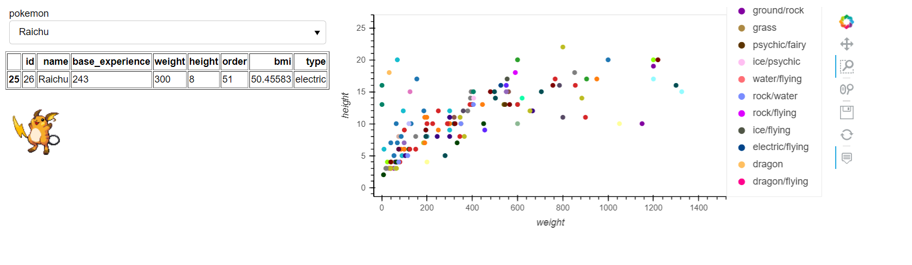
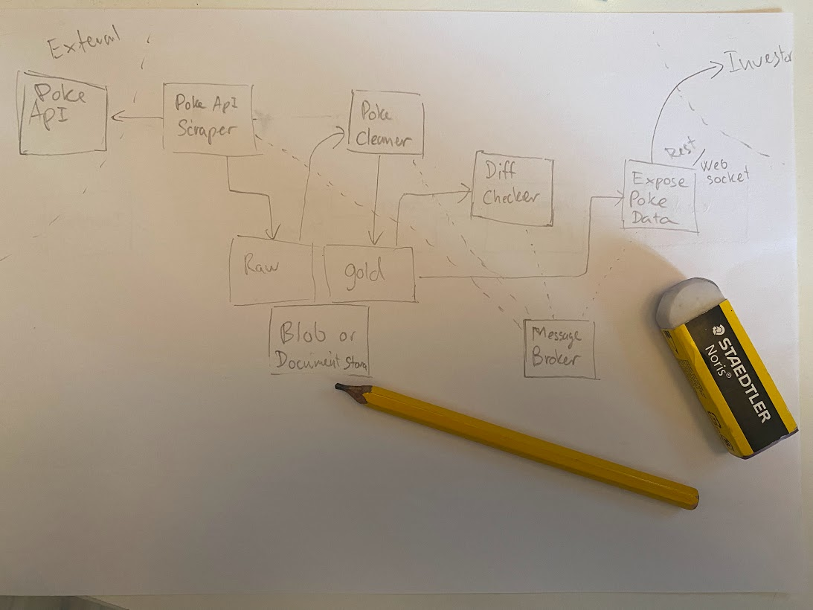

# gotta-process-em-all
Interview case example.
# Data pipeline
The output from the pipeline is stored in csv. pokemons.csv

# Dashboard application
This is a screen shot of the dashboard implemented in panel, when changing pokemon from the
dropdown it will update the stats and picture. Side bonus, BMI chart of the pokemons classified by type. 
I decided to go with aggregating the types in order to keep it in one string field. Now it becomes
a bit of a problem, but that can be fixed by a bit of reformatting, fx by selecting only the primary type.

in order to run the application from terminal: `panel serve app.py`

# Architecture diagram

i would do it by segregating the each step into a separate service and keep all the raw data,
likely the users want another field. then clean it. do the diff whenever recieving info from message broker 
that a new cleaned file is ready, compare with the second to last cleaned file, but check that the version of the 
cleaner is the same. if not, rerun on raw data based on old messages and latest version of cleaner.
if the diff detects a change, write a message to the message broker, that the expose service can pick up. 
expose by web socket or rest based on urgency/interface available to the investor.

# Spark considerations
Assuming the above architechture diagram.
I order to make this solution run in spark, assuming that the api can handle it, it would 
make sense to parallelize out the data fetching on serveral nodes. 
 cleaning the data can easlily run in parallel.
Since each of the input functions basically contains a single pokemon, you would do the equivalent of map(clean_fn, pokemons)
Same with checking the difference from last to next.